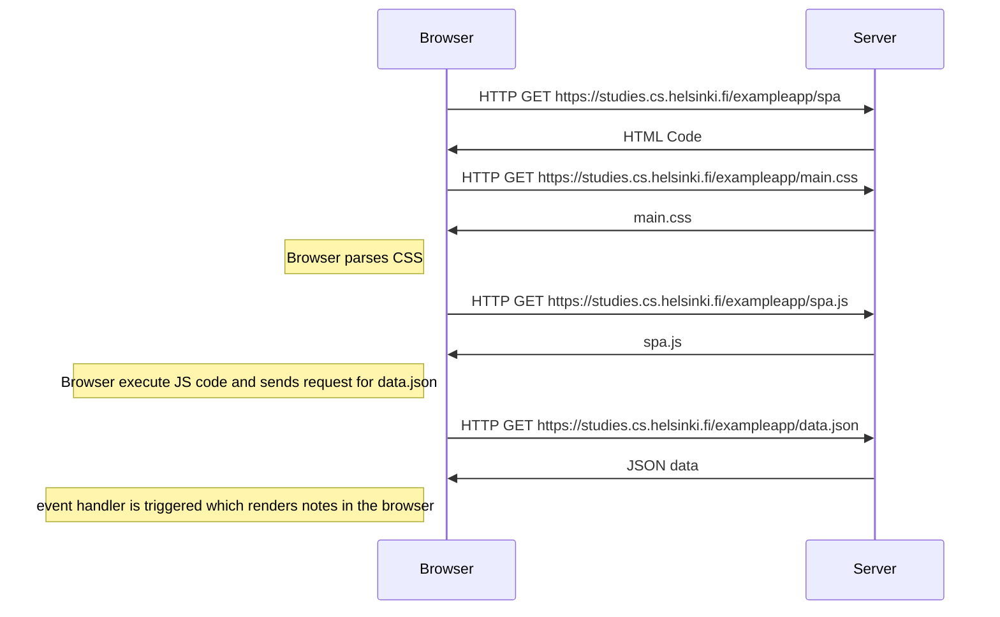

```mermaid
sequenceDiagram
    participant Browser
    participant Server
    Browser->>Server: HTTP GET https://studies.cs.helsinki.fi/exampleapp/spa
    Server->>Browser: HTML Code
    Browser->>Server: HTTP GET https://studies.cs.helsinki.fi/exampleapp/main.css
    Server->>Browser: main.css
    note left of Browser: Browser parses CSS
    Browser->>Server: HTTP GET https://studies.cs.helsinki.fi/exampleapp/spa.js
    Server->>Browser: spa.js
    note left of Browser: Browser execute JS code and sends request for data.json
    Browser->>Server: HTTP GET https://studies.cs.helsinki.fi/exampleapp/data.json
    Server->>Browser: JSON data
    note left of Browser: event handler is triggered which renders notes in the browser
```
