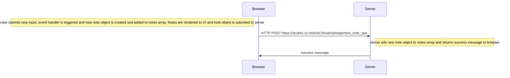

```mermaid
sequenceDiagram
    participant Browser
    participant Server
    note left of Browser: User submits new input, event handler is triggered and new note object is created and added to notes array. Notes are rendered to UI and note object is submited to server
    Browser->>Server: HTTP POST https://studies.cs.helsinki.fi/exampleapp/new_note_spa
    note right of Server: server ads new note object to notes array and returns success message to browser
    Server->>Browser: success message
```
