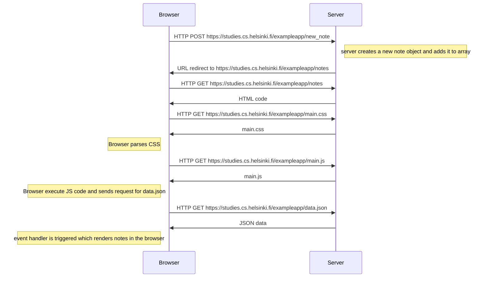

```mermaid
sequenceDiagram
    participant Browser
    participant Server
    Browser->>Server: HTTP POST https://studies.cs.helsinki.fi/exampleapp/new_note
    note right of Server: server creates a new note object and adds it to array
    Server->>Browser: URL redirect to https://studies.cs.helsinki.fi/exampleapp/notes
    Browser->>Server: HTTP GET https://studies.cs.helsinki.fi/exampleapp/notes
    Server->>Browser: HTML code 
    Browser->>Server: HTTP GET https://studies.cs.helsinki.fi/exampleapp/main.css
    Server->>Browser: main.css
    note left of Browser: Browser parses CSS
    Browser->>Server: HTTP GET https://studies.cs.helsinki.fi/exampleapp/main.js
    Server->>Browser: main.js
    note left of Browser: Browser execute JS code and sends request for data.json
    Browser->>Server: HTTP GET https://studies.cs.helsinki.fi/exampleapp/data.json
    Server->>Browser: JSON data
    note left of Browser: event handler is triggered which renders notes in the browser
```
